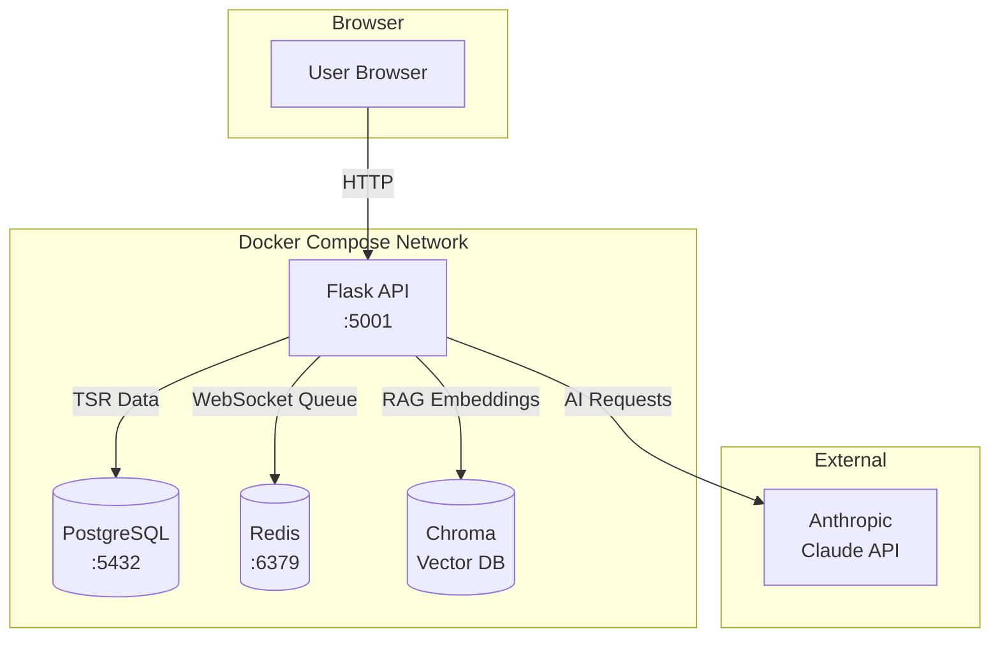
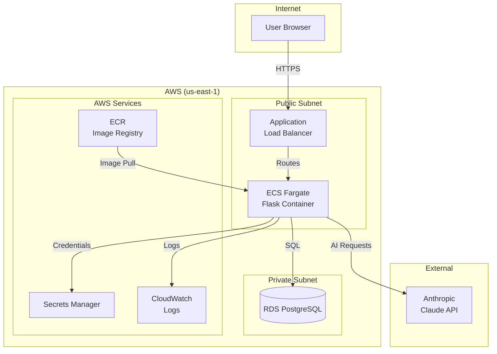

# AI Testing Resource

An interactive Flask application that teaches how AI evaluations fit into the classical testing pyramid.

## Core Thesis

**AI Evals are acceptance tests for AI behavior.** They verify the AI does what you want it to do, while traditional tests handle the deterministic aspects of the software.

## Features

- **Sample App**: Acme Widgets support bot with three iterative versions (V1: Verbose, V2: Hallucinating, V3: Accurate)
- **Test Suite**: Unit, integration, e2e, acceptance, security, performance, and AI eval tests
- **Educational Viewer**: Browse tests, inspect traces, and understand the iteration process
- **Governance Portal**: TSR dashboard with go/no-go rules engine and approval workflows
- **Production Monitoring**: Real-time trace streaming with anomaly and drift detection

## Architecture

### Local Development (Docker Compose)



**Components:**
- **PostgreSQL**: Stores Test Summary Reports (TSR) and governance data
- **Redis**: Pub/sub queue for real-time WebSocket streaming
- **Chroma**: Vector database for RAG embeddings (V3 accurate responses)

### AWS Production



**Components:**
- **ECS Fargate**: Serverless containers with Spot instances for cost efficiency
- **ALB**: HTTPS termination and health checks
- **RDS PostgreSQL**: Managed database in private subnet for security
- **Secrets Manager**: Stores Anthropic API key and database credentials

## Quick Start: Local Python

```bash
# 1. Create and activate virtual environment
python3 -m venv .venv
source .venv/bin/activate  # macOS/Linux
# .venv\Scripts\activate   # Windows

# 2. Install dependencies
pip install -r requirements.txt

# 3. Set up environment
cp .env.example .env
# Edit .env and add your ANTHROPIC_API_KEY

# 4. Initialize knowledge base
python -c "from app.rag import initialize_knowledge_base; initialize_knowledge_base()"

# 5. Run the application
python run.py
```

Open in browser: `http://localhost:5000`

## Quick Start: Docker Compose

```bash
# 1. Set API key
cp .env.docker .env
# Edit .env and add your ANTHROPIC_API_KEY

# 2. Start services
docker compose up -d

# 3. Access application
open http://localhost:5001
```

## Browser Routes

| Route | Description |
|-------|-------------|
| `/` | Redirects to ask page |
| `/ask` | Demo support bot |
| `/viewer/tests` | Test Navigator |
| `/viewer/traces` | Trace Inspector |
| `/viewer/timeline` | Iteration Timeline |
| `/governance/dashboard` | TSR Dashboard |
| `/monitoring/traces` | Live Monitoring |

## The Three Versions

| Version | Issue | Result |
|---------|-------|--------|
| **V1 - Verbose** | System prompt asks for 300+ word responses | Fails length evals (users want ~80 words) |
| **V2 - Hallucinating** | No access to actual company data | Confidently makes up pricing and policies |
| **V3 - Accurate (RAG)** | Uses Chroma for retrieval-augmented generation | Concise AND accurate responses |

## Running Tests

```bash
# Activate virtual environment
source .venv/bin/activate

# Run all tests
pytest

# Run specific test type
pytest tests/unit/
pytest tests/evals/

# Run with coverage
pytest --cov=app --cov=viewer
```

## Environment Variables

| Variable | Description | Default |
|----------|-------------|---------|
| `ANTHROPIC_API_KEY` | Your Anthropic API key | Required |
| `ANTHROPIC_MODEL` | Claude model to use | claude-sonnet-4-20250514 |
| `FLASK_DEBUG` | Enable debug mode | True |
| `FLASK_PORT` | Port to run on | 5000 |
| `CHROMA_PATH` | Path to Chroma database | ./chroma_db |
| `TSR_DATABASE_URL` | PostgreSQL connection (Docker) | postgresql://... |
| `MONITORING_ENABLED` | Enable monitoring subsystem | True |

## Project Structure

```
ai-testing-resource/
├── app/                    # Sample App: Acme Support Bot
│   ├── ai_service.py       # V1, V2, V3 implementations
│   ├── rag.py              # Chroma RAG pipeline
│   └── utils.py            # Input sanitization, token counting
│
├── viewer/                 # Educational Viewer
│   ├── routes.py           # Flask routes
│   ├── governance.py       # TSR dashboard routes
│   └── templates/          # Jinja2 templates
│
├── tsr/                    # Test Summary Report subsystem
│   ├── models.py           # Data models
│   ├── rules.py            # Go/no-go engine
│   ├── generator.py        # TSR generation
│   └── api.py              # REST API
│
├── monitoring/             # Production monitoring
│   ├── anomaly.py          # Anomaly detection
│   ├── drift.py            # Drift detection
│   └── stream.py           # WebSocket streaming
│
├── tests/                  # Complete Test Suite
│   ├── unit/               # Deterministic function tests
│   ├── integration/        # Component interaction tests
│   ├── e2e/                # Full user flow tests
│   ├── acceptance/         # Requirement verification
│   ├── evals/              # AI behavior evaluations
│   ├── security/           # Prompt injection tests
│   └── performance/        # Latency and token tests
│
├── data/
│   ├── knowledge_base/     # RAG documents
│   ├── traces/             # Pre-generated AI traces
│   └── explanations/       # Educational content
│
└── scripts/                # Utility scripts
    ├── init_database.py    # Database initialization
    ├── seed_test_data.py   # Sample data seeding
    └── generate_tsr.py     # TSR generation CLI
```

## Docker Commands Reference

```bash
# Start services
docker compose up -d

# View logs
docker compose logs -f api

# Run tests in container
docker compose exec api pytest tests/ -v

# Database shell
docker compose exec postgres psql -U tsr_user -d tsr_db

# Stop services
docker compose down

# Full reset (deletes all data)
docker compose down -v
```

## Deployment to AWS

This application is deployed to AWS ECS Fargate and integrated into the portfolio at `https://portfolio.cookinupideas.com/ai-evals/`.

### Architecture

The production deployment uses:
- **ECS Fargate**: Serverless containers (0.25 vCPU, 512MB) with Spot instances
- **RDS PostgreSQL**: Managed database (db.t4g.micro, 20GB) in private subnet
- **Application Load Balancer**: HTTPS termination and health checks
- **API Gateway**: HTTP API with VPC Link for CloudFront integration
- **ECR**: Docker image registry
- **Secrets Manager**: Secure storage for API keys and credentials
- **CloudWatch Logs**: Container log aggregation

See architecture diagrams in the [Architecture section](#architecture) above.

### Prerequisites

Before deploying, ensure you have:

- [ ] AWS CLI installed and configured (`aws configure`)
- [ ] AWS credentials in `~/.aws/credentials` with appropriate permissions
- [ ] Docker installed and running
- [ ] Terraform v1.0+ installed
- [ ] `jq` command-line JSON processor
- [ ] Git for commit-based image tagging
- [ ] Anthropic API key (`ANTHROPIC_API_KEY`)

### Step 1: Deploy Infrastructure (One-Time Setup)

Deploy the AWS infrastructure using Terraform:

```bash
# Navigate to terraform directory
cd ../terraform/

# Initialize Terraform
terraform init

# Set required variables
export TF_VAR_anthropic_api_key="$ANTHROPIC_API_KEY"

# Plan infrastructure (review changes)
terraform plan -out=tfplan.plan

# Apply infrastructure
terraform apply tfplan.plan

# Save important outputs
terraform output -raw alb_dns_name > alb_domain.txt
terraform output -raw ecr_repository_url > ecr_url.txt
```

This creates all AWS resources:
- VPC with public/private subnets
- Security groups for ALB, ECS, and RDS
- RDS PostgreSQL database
- ECS Fargate cluster and service
- ECR repository
- Application Load Balancer
- API Gateway with VPC Link

For detailed infrastructure documentation, see [terraform/README.md](../terraform/README.md).

### Step 2: Deploy Application

Build and deploy the Docker container:

```bash
# Navigate back to application directory
cd ../ai-testing-resource/

# Ensure .env file has ANTHROPIC_API_KEY
cp .env.example .env
# Edit .env and add your API key

# Run deployment script
./scripts/deploy.sh
```

The deployment script will:
1. Authenticate with AWS ECR
2. Build Docker image with current git commit as tag
3. Push image to ECR with both commit SHA and `latest` tags
4. Update ECS task definition with new image
5. Deploy new task definition to ECS service
6. Wait for service to become stable

**Deployment time**: ~3-5 minutes

### Step 3: Verify Deployment

Run the verification script to check all endpoints:

```bash
./scripts/verify-deployment.sh
```

This checks:
- Health endpoint: `GET /health`
- Root page: `GET /`
- Ask page: `GET /ask`
- Governance dashboard: `GET /governance/dashboard`

**Manual verification**:
```bash
# Visit the application
open https://portfolio.cookinupideas.com/ai-evals/

# Check CloudWatch logs
aws logs tail /ecs/ai-testing-resource-prod --follow

# Check ECS service status
aws ecs describe-services \
  --cluster ai-testing-resource-prod \
  --services ai-testing-resource-prod \
  --query 'services[0].{Status:status,Running:runningCount,Desired:desiredCount,Health:healthCheck}'
```

### Environment Variables (Production)

The ECS task definition includes these environment variables:

| Variable | Value | Purpose |
|----------|-------|---------|
| `ANTHROPIC_API_KEY` | From Secrets Manager | Claude API authentication |
| `TSR_DATABASE_URL` | From Secrets Manager | PostgreSQL connection string |
| `APPLICATION_ROOT` | `/ai-evals` | Proxy path routing |
| `SECRET_KEY` | Generated by Terraform | Flask session secret |
| `FLASK_HOST` | `0.0.0.0` | Bind to all interfaces |
| `FLASK_PORT` | `5000` | Container port |
| `CHROMA_PATH` | `/app/chroma_db` | Vector database path |
| `MONITORING_ENABLED` | `True` | Enable monitoring |
| `TRACE_RETENTION_HOURS` | `24` | How long to keep traces |

These are configured in `terraform/modules/ecs/main.tf`.

### Integration with Portfolio

This application integrates with the proto-portal-showcase-hub portfolio via CloudFront routing:

1. Portfolio CloudFront distribution routes `/ai-evals/*` traffic to this app's ALB
2. Get the ALB domain from Terraform outputs:
   ```bash
   cd ../terraform/
   terraform output -raw alb_dns_name
   ```
3. Pass this to the portfolio's Terraform configuration:
   ```bash
   cd /path/to/proto-portal-showcase-hub/terraform/
   terraform apply -var="ai_evals_alb_domain=<ALB_DNS_NAME>"
   ```

### Cost Estimate

**Monthly cost**: ~$19/month

- ECS Fargate (Spot): ~$3/month
- RDS PostgreSQL: ~$15/month
- ALB: ~$16/month (may be shared with portfolio)
- API Gateway: ~$0.01/month
- ECR storage: ~$0.50/month
- Secrets Manager: ~$0.40/month
- CloudWatch Logs: ~$0.50/month

**Cost optimization**:
- Uses Fargate Spot instances for 70% cost savings
- Minimal RDS instance (db.t4g.micro)
- Low-traffic API Gateway pricing
- Shared ALB with portfolio (if applicable)

### Troubleshooting Deployment

**Proxy routing issues** (404 errors):
- Verify `APPLICATION_ROOT=/ai-evals` is set in ECS task definition
- Check ALB target group forwards to correct port (5000)

**Health check failures**:
- View CloudWatch logs: `aws logs tail /ecs/ai-testing-resource-prod --follow`
- Check target group health: `aws elbv2 describe-target-health --target-group-arn <TG_ARN>`
- Ensure app binds to `0.0.0.0:5000` not `127.0.0.1:5000`

**Database connection errors**:
- Verify security groups allow ECS → RDS on port 5432
- Check `TSR_DATABASE_URL` in Secrets Manager
- Ensure RDS is in same VPC as ECS

**Build failures**:
- Test Docker build locally first:
  ```bash
  docker build -t test:local .
  docker run -p 5000:5000 --env-file .env test:local
  ```

For more troubleshooting guidance, see [.claude/CLAUDE.md](../.claude/CLAUDE.md#troubleshooting).

### CI/CD Integration

GitHub Actions can automate deployments using OIDC authentication:

```yaml
- name: Configure AWS credentials
  uses: aws-actions/configure-aws-credentials@v4
  with:
    role-to-assume: arn:aws:iam::671388079324:role/github-actions-terraform-bootstrap
    aws-region: us-east-1

- name: Deploy to ECS
  run: |
    cd ai-testing-resource
    ./scripts/deploy.sh
```

### Rollback

To rollback to a previous version:

```bash
# List recent task definition revisions
aws ecs list-task-definitions \
  --family-prefix ai-testing-resource-prod \
  --sort DESC --max-items 5

# Update service to specific revision
aws ecs update-service \
  --cluster ai-testing-resource-prod \
  --service ai-testing-resource-prod \
  --task-definition ai-testing-resource-prod:REVISION_NUMBER

# Wait for rollback to complete
aws ecs wait services-stable \
  --cluster ai-testing-resource-prod \
  --services ai-testing-resource-prod
```

