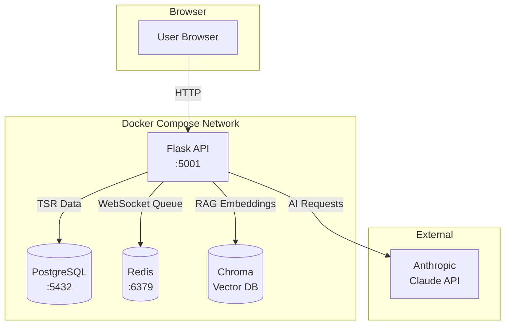
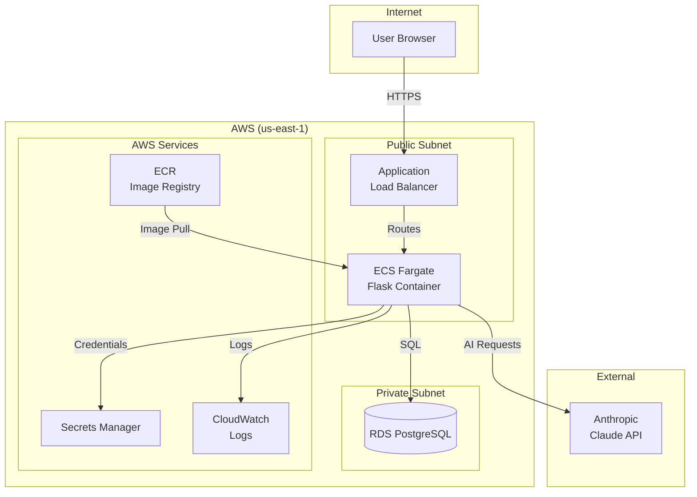

# Plan: Add Architecture Diagram to README

## Summary
Add Mermaid architecture diagrams to `/ai-testing-resource/README.md` covering both local Docker Compose and AWS production deployments.

## File to Modify
`/ai-testing-resource/README.md` - Insert new "## Architecture" section after "## Features" (after line 15)

## Changes

### Add Architecture Section with Two Mermaid Diagrams

**1. Local Development (Docker Compose) Diagram:**

**2. AWS Production Diagram:**

**3. Brief component descriptions:**
- Local: PostgreSQL for TSR storage, Redis for WebSocket pub/sub, Chroma for RAG
- AWS: ECS Fargate with Spot instances, ALB for HTTPS, RDS in private subnet

## Verification
1. View the modified README on GitHub to confirm Mermaid diagrams render
2. Cross-check diagram components against `docker-compose.yml` and `terraform/main.tf`
